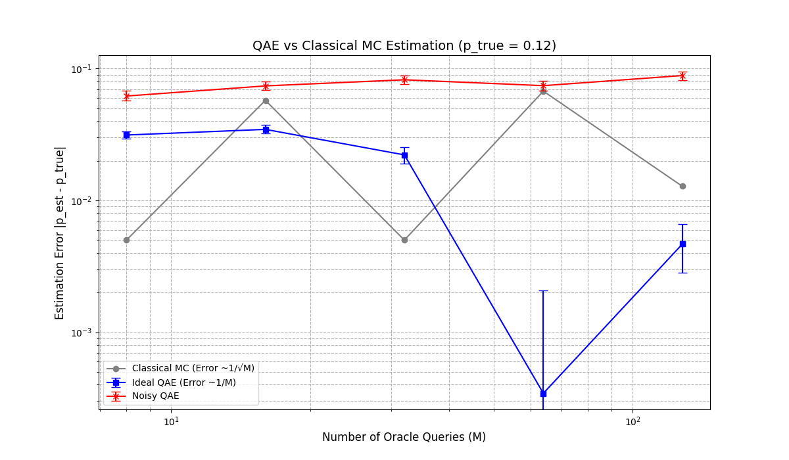

# Quantum Simulation for High-Energy Physics and Statistical Processes

This repository contains two distinct but related quantum simulation projects implemented in Qiskit, showcasing how quantum algorithms can offer advantages over classical methods for scientific computing. The project is structured as a modular Python application to demonstrate best practices in software development.

1.  **Part 1: Quantum Amplitude Estimation (QAE)** for estimating a particle decay probability with a quadratic speedup.
2.  **Part 2: Quantum Galton Board (QGB)** for efficiently generating complex statistical distributions.

---

## Part 1: Estimating a Particle Decay Probability with QAE

This simulation demonstrates the quadratic speedup of Quantum Amplitude Estimation (QAE) over Classical Monte Carlo (CMC) methods for a common problem in high-energy physics.

### The Physics Scenario (Simplified)

Imagine an experiment produces a new, unstable particle, the "Zeta" particle (Z). Our theory predicts it can decay in two ways ("channels"):
-   **Channel A (Common):** `Z -> e⁺ + e⁻` (an electron and a positron), with probability `1-p`.
-   **Channel B (Rare/Interesting):** `Z -> µ⁺ + µ⁻` (a muon and an anti-muon), with probability `p`.

The goal is to precisely estimate the unknown probability `p` of the rare decay.

### The Computational Approach

-   **Classical Monte Carlo (CMC):** We simulate `M` decay events, count how many times we observe the rare Channel B, and estimate `p̂ = (count of B) / M`. The error of this method scales as **O(1/√M)**.
-   **Quantum Amplitude Estimation (QAE):** We encode the probability `p` into the amplitude of a qubit. The QAE algorithm can then estimate this value with an error scaling of **O(1/M)**, offering a significant quadratic speedup in precision.

### How to Run This Simulation

To run the QAE vs. Classical comparison, execute the `main.py` script as a module from the project's root directory:
```bash
python -m src.main
```
The final convergence plot will be saved in the `results/` directory.

### Results: QAE

The simulation results clearly demonstrate the theoretical quadratic speedup of QAE. The quantum method (blue line) converges to the true value much more rapidly than the classical method (gray line).



---

## Part 2: Quantum Galton Board Challenge

This part of the project implements the "Quantum Galton Board" challenge, which demonstrates how to generate specific probability distributions using a quantum circuit, simulate them under ideal and noisy conditions, and rigorously analyze the results.

### Challenge Deliverables Met

-   **General Algorithm:** The `src/quantum_galton_board.py` module generates a circuit for any number of layers, producing a binomial (near-Gaussian) distribution via a Hadamard walk.
-   **Different Target Distributions:** The code is modified to produce an **Exponential** distribution by adjusting the `Ry` gate parameters for each qubit.
-   **Noisy & Optimized Implementation:** The simulation can be run with a custom depolarizing noise model, and the Qiskit transpiler is set to `optimization_level=3` to maximize circuit efficiency.
-   **Distance & Uncertainty:** The simulation computes the **Kullback-Leibler (KL) Divergence** between the experimental and theoretical distributions and uses **bootstrapping** to calculate a 95% confidence interval for this distance, properly accounting for stochastic uncertainty.

### How to Run This Simulation

To run the full Galton Board simulation, execute the `main_qgb.py` script as a module from the project's root directory:
```bash
python -m src.main_qgb
```
The final plots for the normal and exponential distributions will be saved in the `results/` directory.

### Results: QGB


---

## Installation and Setup

1.  **Clone the repository:**
    ```bash
    git clone https://github.com/Deepins49/quantum-monte-carlo-project.git
    ```
2.  **Navigate to the project directory:**
    ```bash
    cd quantum-monte-carlo-project
    ```
3.  **Create and activate a virtual environment:**
    ```bash
    # Create the environment
    python3 -m venv venv
    
    # Activate on Linux/macOS (bash/zsh)
    source venv/bin/activate
    
    # Activate on Linux/macOS (fish)
    source venv/bin/activate.fish
    
    # Activate on Windows
    .\venv\Scripts\activate
    ```
4.  **Install the required packages:**
    ```bash
    pip install -r requirements.txt
    ```

## Repository Structure
```
.
├── README.md
├── requirements.txt
├── results/
│   ├── convergence_plot.png
│   └── ... (qgb plots)
└── src/
    ├── __init__.py
    ├── main.py
    ├── main_qgb.py
    ├── classical_simulation.py
    ├── quantum_simulation.py
    ├── quantum_galton_board.py
    ├── plotting.py
    ├── plotting_qgb.py
    └── analysis.py
```
